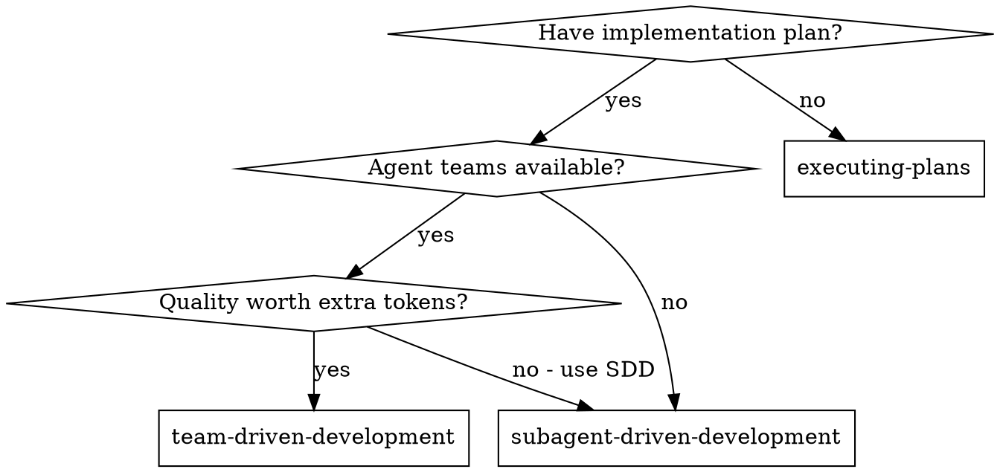
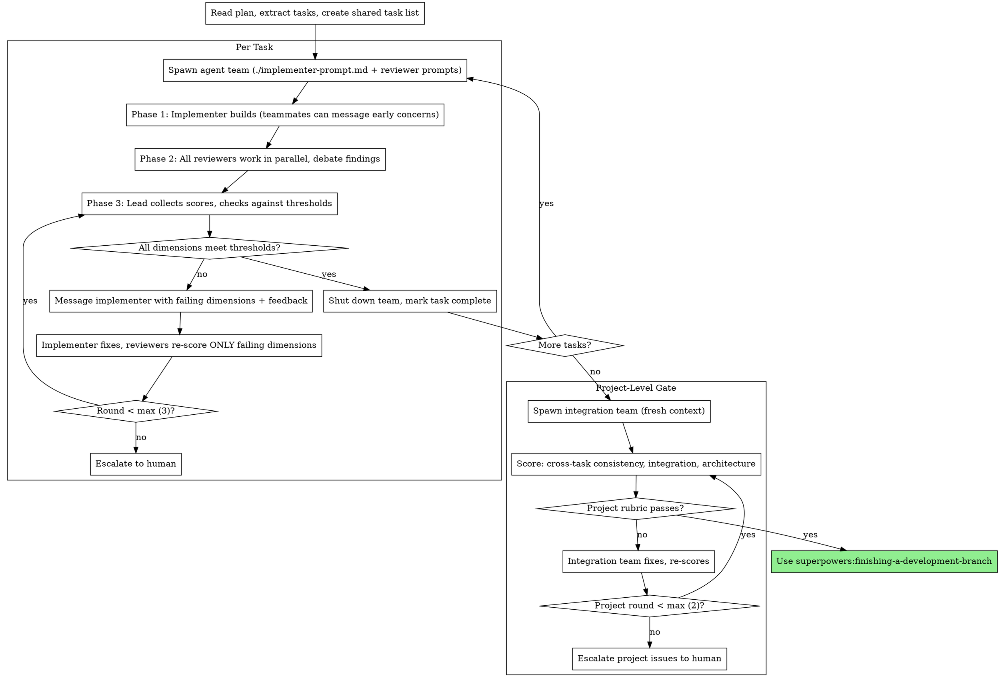

# Team-Driven Development Implementation Plan

> **For agentic workers:** REQUIRED: Use superpowers:subagent-driven-development (recommended) or superpowers:executing-plans to implement this plan task-by-task. Steps use checkbox (`- [ ]`) syntax for tracking.

**Goal:** Add a 3rd execution option to superpowers that uses Claude Code's native Agent Teams for parallel multi-angle review with adversarial debate and scoring rubric convergence loops.

**Architecture:** New skill `team-driven-development` with 8 files (SKILL.md + 7 prompt templates), modification to `writing-plans` to present 3 execution options, and test infrastructure. The skill spawns agent teams per task with specialist teammates, collects numeric scores against a configurable rubric, and loops until thresholds are met.

**Tech Stack:** Markdown skill files, bash test scripts, Claude Code Agent Teams API (`CLAUDE_CODE_EXPERIMENTAL_AGENT_TEAMS`)

---

### Task 1: Create team-driven-development SKILL.md

**Files:**
- Create: `skills/team-driven-development/SKILL.md`

- [ ] **Step 1: Create the skill directory**

```bash
mkdir -p skills/team-driven-development
```

- [ ] **Step 2: Write SKILL.md**

Create `skills/team-driven-development/SKILL.md` with the following content:

```markdown
---
name: team-driven-development
description: Use when executing implementation plans and agent teams are available, for highest quality output with parallel multi-angle review and scoring rubric convergence
---

# Team-Driven Development

Execute plan by spawning agent teams with specialist teammates per task. Teammates review in parallel, debate findings adversarially, and score against a configurable rubric. Convergence loops repeat until all quality dimensions meet their thresholds.

**Why agent teams over subagents:** Agent teams are separate Claude Code instances that communicate directly with each other. Unlike subagents (which only report back to the caller), teammates can debate findings, challenge each other's assessments, and surface disagreements. This adversarial dynamic produces higher quality than sequential isolated review.

**Core principle:** Agent team per task + parallel specialist review + adversarial debate + scoring rubric convergence = highest quality output

**Prerequisite:** Requires `CLAUDE_CODE_EXPERIMENTAL_AGENT_TEAMS` enabled in settings.json or environment.

## When to Use



**vs. Subagent-Driven Development:**

| | SDD | Team-Driven |
|---|---|---|
| Primitive | Subagents (report back only) | Agent Teams (inter-agent communication) |
| Review | Sequential: spec → quality | Parallel: all specialists simultaneously |
| Quality gate | Pass/fail per reviewer | Numeric scoring rubric (1-10) with thresholds |
| Iteration | Fix loop per reviewer | Convergence loop until rubric met |
| Communication | Implementer ↔ controller only | Teammates debate and challenge each other |
| Dimensions | Fixed 2 review stages | 4 core + user-defined extras |
| Token cost | Lower | Higher (tradeoff for quality) |

## The Process



## Quality Rubric

The rubric is defined in the plan document header. It has 4 core dimensions (always present) plus user-configurable extras.

**Core Dimensions:**

| Dimension | Default Threshold | Teammate Role | Focus |
|-----------|-------------------|---------------|-------|
| Spec Compliance | ≥ 8 | Spec Reviewer | Does implementation match plan exactly? |
| Code Quality | ≥ 7 | Code Quality Reviewer | Clean, maintainable, follows patterns? |
| Test Coverage | ≥ 7 | Test Analyst | Tests meaningful, edge cases covered? |
| Correctness | ≥ 8 | Correctness Reviewer | Does it actually work? Integration sound? |

**Custom Dimensions (examples):**

| Dimension | Teammate Role | When to add |
|-----------|---------------|-------------|
| Security | Security Reviewer | Auth, user input, tokens, API keys |
| Performance | Performance Analyst | Hot paths, large data, latency-sensitive |
| Accessibility | Accessibility Reviewer | UI components, user-facing features |
| i18n | i18n Reviewer | Multi-language, locale-sensitive |

Each dimension spawns an additional teammate using `./custom-reviewer-prompt.md`.

**Scoring rules:**
- Each reviewer scores their dimension 1-10 with written justification
- All dimensions must meet their threshold for the task to pass
- On re-score rounds, only failing dimensions are re-evaluated
- Max 3 convergence rounds per task before escalating to human
- Max 2 rounds for project-level gate

## Rubric in Plan Header

When team-driven is chosen, the plan header includes:

```markdown
**Quality Rubric:**

| Dimension | Threshold | Teammate Role | Notes |
|-----------|-----------|---------------|-------|
| Spec Compliance | ≥ 8 | Spec Reviewer | Core |
| Code Quality | ≥ 7 | Code Quality Reviewer | Core |
| Test Coverage | ≥ 7 | Test Analyst | Core |
| Correctness | ≥ 8 | Correctness Reviewer | Core |

**Loop Config:**
- Max rounds per task: 3
- Max rounds project gate: 2
- Escalate to human on: threshold not met after max rounds
```

## Spawning the Team

For each task, the lead spawns an agent team:

```
Create an agent team for Task N: [task name].

Teammates:
- Implementer: [spawn with ./implementer-prompt.md content]
- Spec Reviewer: [spawn with ./spec-reviewer-prompt.md content]
- Code Quality Reviewer: [spawn with ./code-quality-reviewer-prompt.md content]
- Test Analyst: [spawn with ./test-analyst-prompt.md content]
- Correctness Reviewer: [spawn with ./correctness-reviewer-prompt.md content]
- [Custom reviewers from rubric config, each with ./custom-reviewer-prompt.md]

Require plan approval for Implementer before they make changes.
```

**Model Selection (same as SDD):**
- Mechanical implementation → fast, cheap model
- Integration/judgment → standard model
- Architecture/design/review → most capable model

## Handling Implementer Status

Same as SDD — implementers report DONE, DONE_WITH_CONCERNS, NEEDS_CONTEXT, or BLOCKED. Handle each per the SDD skill's guidance.

## Convergence Loop

The loop is event-driven, not interval-based:

**Round 1:**
1. Team spawned, implementer builds, reviewers review in parallel
2. Lead collects all scores
3. Any dimension below threshold? → Round 2

**Round 2+:**
1. Lead messages implementer with specific failing dimensions and reviewer feedback
2. Implementer fixes issues
3. Lead asks ONLY failing-dimension reviewers to re-score
4. Still below threshold? → Next round or escalate

**Escalation format:**
```
Task N stuck after 3 rounds.
Failing dimensions:
- Test Coverage: 6/7 — "Missing edge case for empty input, no error path tests"
- Spec Compliance: 7/8 — "Progress reporting interval hardcoded, spec says configurable"

Options:
1. Adjust thresholds (lower requirements)
2. Provide guidance (specific direction for implementer)
3. Skip this dimension (accept current score)
4. Take over manually
```

## Project-Level Gate

After all tasks complete:

1. Spawn fresh integration team (no per-task context pollution)
2. Teammates score across the entire implementation:
   - Cross-task consistency (naming, patterns, error handling)
   - Integration correctness (do components work together?)
   - Architectural coherence (does the whole make sense?)
3. Loop until passing or max 2 rounds → escalate

## Prompt Templates

- `./implementer-prompt.md` — Implementer teammate
- `./spec-reviewer-prompt.md` — Spec compliance reviewer (scores 1-10)
- `./code-quality-reviewer-prompt.md` — Code quality reviewer (scores 1-10)
- `./test-analyst-prompt.md` — Test coverage analyst (scores 1-10)
- `./correctness-reviewer-prompt.md` — Correctness/integration reviewer (scores 1-10)
- `./rubric-scorer-prompt.md` — Lead template for collecting and evaluating scores
- `./custom-reviewer-prompt.md` — Parameterized template for user-defined dimensions

## Red Flags

**Never:**
- Start implementation on main/master branch without explicit user consent
- Skip any rubric dimension (all must be scored)
- Proceed with dimensions below threshold without looping or escalating
- Let implementer self-review replace teammate review
- Spawn multiple implementation teammates in parallel for the same task (file conflicts)
- Skip the project-level gate after all tasks
- Shut down team before all scores are collected
- Re-score passing dimensions (waste of tokens)
- Exceed max convergence rounds without escalating to human

**If teammates disagree:**
- Disagreement is valuable — it surfaces real issues
- Lead should NOT suppress debate
- If reviewers challenge each other, let them resolve it
- Only intervene if debate becomes circular (3+ messages without progress)

**If implementer is blocked:**
- Same as SDD: provide context, upgrade model, break task, or escalate
- Never ignore escalation

## Integration

**Required workflow skills:**
- **superpowers:using-git-worktrees** — REQUIRED: Set up isolated workspace before starting
- **superpowers:writing-plans** — Creates the plan (modified to offer team-driven option)
- **superpowers:finishing-a-development-branch** — Complete development after all tasks

**Teammates should use:**
- **superpowers:test-driven-development** — Follow TDD for implementation

**Alternative workflows:**
- **superpowers:subagent-driven-development** — Lower cost, sequential review
- **superpowers:executing-plans** — Inline execution with checkpoints
```

- [ ] **Step 3: Verify the file exists and word count is reasonable**

```bash
wc -w skills/team-driven-development/SKILL.md
# Expected: 800-1200 words (larger than typical skill due to complexity, but acceptable)
ls skills/team-driven-development/SKILL.md
```

- [ ] **Step 4: Commit**

```bash
git add skills/team-driven-development/SKILL.md
git commit -m "feat: add team-driven-development SKILL.md"
```

---

### Task 2: Create implementer-prompt.md

**Files:**
- Create: `skills/team-driven-development/implementer-prompt.md`

- [ ] **Step 1: Write implementer-prompt.md**

This is adapted from SDD's implementer prompt but adds instructions for receiving real-time teammate messages during implementation.

Create `skills/team-driven-development/implementer-prompt.md`:

```markdown
# Implementer Teammate Prompt Template

Use this template when spawning an implementer teammate in a team.

```
Teammate spawn prompt:
  You are the Implementer for Task N: [task name]

  ## Task Description

  [FULL TEXT of task from plan - paste it here, don't make teammate read file]

  ## Context

  [Scene-setting: where this fits, dependencies, architectural context]

  ## Before You Begin

  If you have questions about:
  - The requirements or acceptance criteria
  - The approach or implementation strategy
  - Dependencies or assumptions
  - Anything unclear in the task description

  **Message the lead now.** Raise any concerns before starting work.

  ## Your Job

  Once you're clear on requirements:
  1. Implement exactly what the task specifies
  2. Write tests (following TDD if task says to)
  3. Verify implementation works
  4. Commit your work
  5. Self-review (see below)
  6. Report back with status

  Work from: [directory]

  ## Listening to Teammates

  Other teammates (reviewers) may message you during implementation with
  early concerns or observations. When you receive a message from a teammate:

  1. **Read it carefully** — they may have spotted an issue you missed
  2. **Respond acknowledging** — let them know you saw it
  3. **Act on it if valid** — fix the issue before continuing
  4. **Push back if wrong** — explain your reasoning if you disagree

  Do NOT ignore teammate messages. They are reviewing your work in real-time
  and their early feedback prevents rework later.

  ## Code Organization

  - Follow the file structure defined in the plan
  - Each file should have one clear responsibility with a well-defined interface
  - If a file you're creating is growing beyond the plan's intent, stop and
    report it as DONE_WITH_CONCERNS
  - In existing codebases, follow established patterns

  ## When You're in Over Your Head

  It is always OK to stop and say "this is too hard for me." Bad work is worse
  than no work.

  **STOP and escalate when:**
  - The task requires architectural decisions with multiple valid approaches
  - You need to understand code beyond what was provided
  - You feel uncertain about whether your approach is correct
  - The task involves restructuring existing code the plan didn't anticipate

  **How to escalate:** Message the lead with status BLOCKED or NEEDS_CONTEXT.

  ## Before Reporting Back: Self-Review

  **Completeness:** Did I implement everything? Miss any requirements? Edge cases?
  **Quality:** Clean, maintainable, clear names?
  **Discipline:** YAGNI? Only what was requested? Follow existing patterns?
  **Testing:** Tests verify behavior? TDD followed? Comprehensive?

  If you find issues, fix them before reporting.

  ## Report Format

  When done, message the lead:
  - **Status:** DONE | DONE_WITH_CONCERNS | BLOCKED | NEEDS_CONTEXT
  - What you implemented
  - What you tested and results
  - Files changed
  - Self-review findings
  - Any concerns

  Also **broadcast to all teammates** a summary of what you built and where,
  so reviewers can begin their work immediately.
```
```

- [ ] **Step 2: Verify file exists**

```bash
ls skills/team-driven-development/implementer-prompt.md
```

- [ ] **Step 3: Commit**

```bash
git add skills/team-driven-development/implementer-prompt.md
git commit -m "feat: add implementer teammate prompt template"
```

---

### Task 3: Create spec-reviewer-prompt.md

**Files:**
- Create: `skills/team-driven-development/spec-reviewer-prompt.md`

- [ ] **Step 1: Write spec-reviewer-prompt.md**

Adapted from SDD's spec reviewer but outputs a numeric score and includes debate instructions.

Create `skills/team-driven-development/spec-reviewer-prompt.md`:

```markdown
# Spec Compliance Reviewer Teammate Prompt Template

Use this template when spawning a spec compliance reviewer teammate.

**Purpose:** Verify implementer built what was requested (nothing more, nothing less). Score 1-10.

```
Teammate spawn prompt:
  You are the Spec Compliance Reviewer for Task N: [task name]

  ## What Was Requested

  [FULL TEXT of task requirements from plan]

  ## CRITICAL: Do Not Trust the Implementer's Report

  The implementer's broadcast may be incomplete, inaccurate, or optimistic.
  You MUST verify everything independently.

  **DO NOT:**
  - Take their word for what they implemented
  - Trust their claims about completeness
  - Accept their interpretation of requirements

  **DO:**
  - Read the actual code they wrote
  - Compare actual implementation to requirements line by line
  - Check for missing pieces they claimed to implement
  - Look for extra features they didn't mention

  ## Your Job

  Read the implementation code and verify:

  **Missing requirements:**
  - Did they implement everything requested?
  - Requirements they skipped or missed?
  - Claims of implementation that aren't actually there?

  **Extra/unneeded work:**
  - Things built that weren't requested?
  - Over-engineering or unnecessary features?

  **Misunderstandings:**
  - Requirements interpreted differently than intended?
  - Right feature but wrong approach?

  ## Debate with Other Reviewers

  You are part of a review team. When you find issues:

  1. **Message other teammates** with your findings
  2. **Challenge their assessments** if you disagree
  3. **Respond to challenges** from other reviewers with evidence
  4. **Update your assessment** if convinced by their arguments

  If you and another reviewer disagree, explain your reasoning with
  specific code references. Don't defer — defend your position unless
  they show you evidence you missed.

  ## Scoring

  Score spec compliance from 1-10:

  | Score | Meaning |
  |-------|---------|
  | 10 | Perfect match — every requirement met, nothing extra |
  | 8-9 | Minor gaps — small missing detail or trivial extra |
  | 6-7 | Notable gaps — missing requirement or significant extra work |
  | 4-5 | Major gaps — multiple missing requirements or wrong approach |
  | 1-3 | Fundamentally wrong — built the wrong thing |

  ## Report Format

  Message the lead with:
  - **Dimension:** Spec Compliance
  - **Score:** [1-10]
  - **Justification:** [specific findings with file:line references]
  - **Issues (if score < threshold):**
    - Missing: [what's missing]
    - Extra: [what shouldn't be there]
    - Wrong: [misunderstandings]
```
```

- [ ] **Step 2: Commit**

```bash
git add skills/team-driven-development/spec-reviewer-prompt.md
git commit -m "feat: add spec compliance reviewer teammate prompt"
```

---

### Task 4: Create code-quality-reviewer-prompt.md

**Files:**
- Create: `skills/team-driven-development/code-quality-reviewer-prompt.md`

- [ ] **Step 1: Write code-quality-reviewer-prompt.md**

Create `skills/team-driven-development/code-quality-reviewer-prompt.md`:

```markdown
# Code Quality Reviewer Teammate Prompt Template

Use this template when spawning a code quality reviewer teammate.

**Purpose:** Verify implementation is well-built (clean, tested, maintainable). Score 1-10.

```
Teammate spawn prompt:
  You are the Code Quality Reviewer for Task N: [task name]

  ## What Was Implemented

  [Summary from implementer's broadcast]

  ## Plan Context

  [Task description from plan for reference]

  ## Your Job

  Review the code the implementer wrote for quality:

  **Readability:**
  - Clear, accurate naming?
  - Logical structure and flow?
  - Appropriate comments (not too many, not too few)?

  **Maintainability:**
  - Single responsibility per file/function?
  - Well-defined interfaces between components?
  - DRY — no unnecessary duplication?
  - YAGNI — no over-engineering?

  **Patterns:**
  - Follows existing codebase conventions?
  - Consistent style with surrounding code?
  - Appropriate error handling?

  **File Organization:**
  - Each file has one clear responsibility?
  - Files aren't unnecessarily large?
  - Changes follow the plan's file structure?

  ## Debate with Other Reviewers

  You are part of a review team. Share findings with other teammates:

  1. **Message other reviewers** when you find quality issues
  2. **Cross-reference** with spec reviewer — quality issues may indicate spec gaps
  3. **Challenge** other reviewers if you see code issues they missed
  4. **Defend your position** with specific code evidence when challenged

  ## Scoring

  Score code quality from 1-10:

  | Score | Meaning |
  |-------|---------|
  | 10 | Exemplary — clean, well-structured, follows all conventions |
  | 8-9 | Good — minor style issues, small improvements possible |
  | 6-7 | Adequate — works but has notable quality issues |
  | 4-5 | Poor — significant quality problems, hard to maintain |
  | 1-3 | Unacceptable — needs complete rewrite |

  ## Report Format

  Message the lead with:
  - **Dimension:** Code Quality
  - **Score:** [1-10]
  - **Justification:** [specific findings with file:line references]
  - **Strengths:** [what's well done]
  - **Issues (if any):** Critical / Important / Minor with file:line references
```
```

- [ ] **Step 2: Commit**

```bash
git add skills/team-driven-development/code-quality-reviewer-prompt.md
git commit -m "feat: add code quality reviewer teammate prompt"
```

---

### Task 5: Create test-analyst-prompt.md

**Files:**
- Create: `skills/team-driven-development/test-analyst-prompt.md`

- [ ] **Step 1: Write test-analyst-prompt.md**

This is a new role not present in SDD.

Create `skills/team-driven-development/test-analyst-prompt.md`:

```markdown
# Test Analyst Teammate Prompt Template

Use this template when spawning a test analyst teammate.

**Purpose:** Evaluate test coverage, quality, and edge case handling. Score 1-10.

```
Teammate spawn prompt:
  You are the Test Analyst for Task N: [task name]

  ## What Was Implemented

  [Summary from implementer's broadcast]

  ## Task Requirements

  [FULL TEXT of task requirements — needed to assess if tests cover all requirements]

  ## Your Job

  Evaluate the tests the implementer wrote:

  **Coverage:**
  - Does every requirement have at least one test?
  - Are positive cases (happy path) tested?
  - Are negative cases (error paths) tested?
  - Are boundary conditions tested?

  **Edge Cases:**
  - Empty/null/undefined inputs?
  - Maximum/minimum values?
  - Concurrent/async scenarios (if applicable)?
  - Error recovery paths?

  **Test Quality:**
  - Do tests verify behavior, not implementation details?
  - Are test names descriptive of what they verify?
  - Are assertions specific (not just "truthy")?
  - Would a failing test message help debug the issue?
  - Are tests independent (no order dependencies)?

  **TDD Compliance (if task requires TDD):**
  - Were tests written before implementation?
  - Do commit messages show test-first pattern?
  - Are tests minimal (testing one thing each)?

  ## Debate with Other Reviewers

  1. **Cross-reference with spec reviewer** — if spec reviewer found missing
     requirements, check if those gaps also lack tests
  2. **Cross-reference with correctness reviewer** — if correctness reviewer
     found integration issues, flag missing integration tests
  3. **Challenge implementer** if test quality is superficial

  ## Scoring

  Score test coverage from 1-10:

  | Score | Meaning |
  |-------|---------|
  | 10 | Comprehensive — all paths tested, excellent edge cases |
  | 8-9 | Strong — good coverage, minor edge cases missing |
  | 6-7 | Adequate — happy paths tested, notable gaps in edge cases |
  | 4-5 | Weak — major gaps, many untested paths |
  | 1-3 | Insufficient — minimal or no meaningful tests |

  ## Report Format

  Message the lead with:
  - **Dimension:** Test Coverage
  - **Score:** [1-10]
  - **Justification:** [specific findings]
  - **Tested:** [what's well covered]
  - **Missing:** [untested requirements, edge cases, error paths]
  - **Quality issues:** [superficial tests, implementation-coupled tests, etc.]
```
```

- [ ] **Step 2: Commit**

```bash
git add skills/team-driven-development/test-analyst-prompt.md
git commit -m "feat: add test analyst teammate prompt"
```

---

### Task 6: Create correctness-reviewer-prompt.md

**Files:**
- Create: `skills/team-driven-development/correctness-reviewer-prompt.md`

- [ ] **Step 1: Write correctness-reviewer-prompt.md**

Another new role not in SDD.

Create `skills/team-driven-development/correctness-reviewer-prompt.md`:

```markdown
# Correctness Reviewer Teammate Prompt Template

Use this template when spawning a correctness reviewer teammate.

**Purpose:** Verify the implementation actually works and integrates correctly. Score 1-10.

```
Teammate spawn prompt:
  You are the Correctness Reviewer for Task N: [task name]

  ## What Was Implemented

  [Summary from implementer's broadcast]

  ## Task Requirements

  [FULL TEXT of task requirements]

  ## Codebase Context

  [Key integration points, dependencies, related files]

  ## Your Job

  Verify the implementation is functionally correct:

  **Does it work?**
  - Run the tests — do they actually pass?
  - Try the feature manually if possible
  - Check for runtime errors, type errors, import issues

  **Integration:**
  - Does it integrate with existing code correctly?
  - Are imports/exports correct?
  - Do interfaces match what consumers expect?
  - Are there breaking changes to existing functionality?

  **Correctness:**
  - Does the logic handle all cases correctly?
  - Are there off-by-one errors, null pointer issues, race conditions?
  - Does error handling actually work (not just exist)?
  - Are async operations properly awaited/handled?

  **Data flow:**
  - Does data flow through the system correctly?
  - Are transformations accurate?
  - Are edge cases in data handled?

  ## Debate with Other Reviewers

  1. **Challenge spec reviewer** if you find the implementation "matches spec"
     but doesn't actually work correctly
  2. **Cross-reference with test analyst** — if tests pass but behavior is
     wrong, tests may be testing the wrong thing
  3. **Message implementer** with specific reproduction steps for bugs found

  ## Scoring

  Score correctness from 1-10:

  | Score | Meaning |
  |-------|---------|
  | 10 | Correct — all tests pass, integration sound, no issues found |
  | 8-9 | Mostly correct — minor issues that don't affect core functionality |
  | 6-7 | Partially correct — some paths broken, integration issues |
  | 4-5 | Significantly broken — core functionality has bugs |
  | 1-3 | Non-functional — doesn't work at all |

  ## Report Format

  Message the lead with:
  - **Dimension:** Correctness
  - **Score:** [1-10]
  - **Justification:** [specific findings with reproduction steps]
  - **Test results:** [which tests pass/fail]
  - **Integration issues:** [specific incompatibilities found]
  - **Bugs found:** [with file:line and reproduction steps]
```
```

- [ ] **Step 2: Commit**

```bash
git add skills/team-driven-development/correctness-reviewer-prompt.md
git commit -m "feat: add correctness reviewer teammate prompt"
```

---

### Task 7: Create rubric-scorer-prompt.md

**Files:**
- Create: `skills/team-driven-development/rubric-scorer-prompt.md`

- [ ] **Step 1: Write rubric-scorer-prompt.md**

This is a template the lead uses to collect and evaluate scores — not a teammate prompt.

Create `skills/team-driven-development/rubric-scorer-prompt.md`:

```markdown
# Rubric Scorer Template

This is NOT a teammate prompt. The lead uses this template to collect scores
from all reviewer teammates, evaluate against thresholds, and decide whether
to loop or proceed.

## Collecting Scores

After all reviewers have reported, compile the rubric:

```
┌─────────────────┬───────┬───────────┬────────┐
│ Dimension       │ Score │ Threshold │ Status │
├─────────────────┼───────┼───────────┼────────┤
│ Spec Compliance │  X/10 │    ≥ T    │ ✅/❌  │
│ Code Quality    │  X/10 │    ≥ T    │ ✅/❌  │
│ Test Coverage   │  X/10 │    ≥ T    │ ✅/❌  │
│ Correctness     │  X/10 │    ≥ T    │ ✅/❌  │
│ [Custom 1]      │  X/10 │    ≥ T    │ ✅/❌  │
│ [Custom 2]      │  X/10 │    ≥ T    │ ✅/❌  │
└─────────────────┴───────┴───────────┴────────┘
```

## Decision Logic

**All dimensions ≥ threshold:**
→ Task passes. Shut down team. Mark task complete. Move to next task.

**Any dimension below threshold AND round < max:**
→ Message implementer with:
  1. Which dimensions failed
  2. Each failing reviewer's justification and specific issues
  3. Priority order (lowest relative score first)
→ Tell ONLY failing-dimension reviewers to re-score after fixes
→ Do NOT re-score passing dimensions

**Any dimension below threshold AND round = max:**
→ Escalate to human with:
  1. Full rubric table
  2. Each failing dimension's history across rounds
  3. Options: adjust threshold, provide guidance, skip, take over

## Score Conflict Resolution

If two reviewers report conflicting findings about the same code:
1. Present both findings to all reviewers
2. Let them debate (1-2 messages each)
3. If no resolution, present conflict to human for decision

## Round Tracking

Keep track of convergence progress:

```
Task N — Round 2/3
Previously failing: Spec Compliance (6→8 ✅), Test Coverage (5→6 ❌)
Still failing: Test Coverage (6/7)
Reviewer feedback: "Missing edge case for empty input, no error path tests"
```
```

- [ ] **Step 2: Commit**

```bash
git add skills/team-driven-development/rubric-scorer-prompt.md
git commit -m "feat: add rubric scorer template for lead"
```

---

### Task 8: Create custom-reviewer-prompt.md

**Files:**
- Create: `skills/team-driven-development/custom-reviewer-prompt.md`

- [ ] **Step 1: Write custom-reviewer-prompt.md**

Parameterized template for user-defined rubric dimensions.

Create `skills/team-driven-development/custom-reviewer-prompt.md`:

```markdown
# Custom Reviewer Teammate Prompt Template

Use this parameterized template when spawning a teammate for a user-defined
rubric dimension. Replace placeholders with values from the plan's Quality Rubric.

**Placeholders:**
- `{DIMENSION_NAME}` — e.g., "Security", "Performance", "Accessibility"
- `{DIMENSION_DESCRIPTION}` — e.g., "Review for security vulnerabilities..."
- `{THRESHOLD}` — e.g., "7"
- `{NOTES}` — from rubric config, e.g., "This project handles auth tokens"

```
Teammate spawn prompt:
  You are the {DIMENSION_NAME} Reviewer for Task N: [task name]

  ## What Was Implemented

  [Summary from implementer's broadcast]

  ## Task Requirements

  [FULL TEXT of task requirements]

  ## Your Focus: {DIMENSION_NAME}

  {DIMENSION_DESCRIPTION}

  **Project-specific context:** {NOTES}

  ## Your Job

  Review the implementation through the lens of {DIMENSION_NAME}.

  Focus on issues that are specific to your dimension. Do not duplicate
  work of other reviewers (spec compliance, code quality, test coverage,
  correctness are handled by dedicated teammates).

  **Look for:**
  - Issues specific to {DIMENSION_NAME} that other reviewers would miss
  - Patterns that violate {DIMENSION_NAME} best practices
  - Missing considerations that the implementation should address
  - Opportunities for improvement within scope

  **Do NOT flag:**
  - General code quality issues (code quality reviewer handles this)
  - Missing spec requirements (spec reviewer handles this)
  - Test gaps (test analyst handles this)
  - Unless they directly relate to {DIMENSION_NAME}

  ## Debate with Other Reviewers

  1. **Message other teammates** when you find {DIMENSION_NAME} issues
  2. **Challenge other reviewers** if they dismiss a {DIMENSION_NAME} concern
  3. **Respond to challenges** with domain-specific evidence

  ## Scoring

  Score {DIMENSION_NAME} from 1-10:

  | Score | Meaning |
  |-------|---------|
  | 10 | Excellent — no {DIMENSION_NAME} concerns |
  | 8-9 | Good — minor issues, low risk |
  | 6-7 | Adequate — notable issues, medium risk |
  | 4-5 | Poor — significant issues, high risk |
  | 1-3 | Critical — severe {DIMENSION_NAME} problems |

  Threshold for this project: ≥ {THRESHOLD}

  ## Report Format

  Message the lead with:
  - **Dimension:** {DIMENSION_NAME}
  - **Score:** [1-10]
  - **Justification:** [specific findings with file:line references]
  - **Issues:** [categorized by severity]
  - **Recommendations:** [specific fixes]
```
```

- [ ] **Step 2: Commit**

```bash
git add skills/team-driven-development/custom-reviewer-prompt.md
git commit -m "feat: add parameterized custom reviewer teammate prompt"
```

---

### Task 9: Modify writing-plans to add Team-Driven option

**Files:**
- Modify: `skills/writing-plans/SKILL.md:127-145`

- [ ] **Step 1: Update the Execution Handoff section**

Replace the current Execution Handoff section (lines 127-145, including the heading) in `skills/writing-plans/SKILL.md` with:

```markdown
## Execution Handoff

After saving the plan, offer execution choice:

**"Plan complete and saved to `docs/superpowers/plans/<filename>.md`. Three execution options:**

**1. Subagent-Driven (recommended for most tasks)** - Fresh subagent per task, two-stage review, lowest token cost

**2. Inline Execution** - Execute in this session, batch with checkpoints

**3. Team-Driven (highest quality, highest token cost)** - Agent teams with specialist teammates, scoring rubric with convergence loops, adversarial debate between reviewers. Requires `CLAUDE_CODE_EXPERIMENTAL_AGENT_TEAMS`.

**Which approach?"**

**If Subagent-Driven chosen:**
- **REQUIRED SUB-SKILL:** Use superpowers:subagent-driven-development
- Fresh subagent per task + two-stage review

**If Inline Execution chosen:**
- **REQUIRED SUB-SKILL:** Use superpowers:executing-plans
- Batch execution with checkpoints for review

**If Team-Driven chosen:**
- **REQUIRED SUB-SKILL:** Use superpowers:team-driven-development
- Prompt user for rubric configuration:

  "Team-Driven selected. Let's configure your quality rubric.

  4 core dimensions are always included:
  - Spec Compliance (≥ 8)
  - Code Quality (≥ 7)
  - Test Coverage (≥ 7)
  - Correctness (≥ 8)

  What additional quality dimensions matter for this project?
  (e.g., security, performance, accessibility, i18n)

  Or 'none' for core only."

- Confirm thresholds with user (defaults shown above, user can adjust)
- Add Quality Rubric section to plan header before saving
- Agent team per task + parallel specialist review + scoring rubric convergence
```

- [ ] **Step 2: Update the Plan Document Header section**

In the same file, update the header template (around line 49-61) to mention team-driven:

Replace the header block:
```markdown
> **For agentic workers:** REQUIRED SUB-SKILL: Use superpowers:subagent-driven-development (recommended) or superpowers:executing-plans to implement this plan task-by-task. Steps use checkbox (`- [ ]`) syntax for tracking.
```

With:
```markdown
> **For agentic workers:** REQUIRED SUB-SKILL: Use superpowers:team-driven-development (if agent teams available), superpowers:subagent-driven-development (recommended), or superpowers:executing-plans to implement this plan task-by-task. Steps use checkbox (`- [ ]`) syntax for tracking.
```

- [ ] **Step 3: Verify the changes read correctly**

```bash
cat skills/writing-plans/SKILL.md
```

- [ ] **Step 4: Commit**

```bash
git add skills/writing-plans/SKILL.md
git commit -m "feat: add team-driven execution option to writing-plans"
```

---

### Task 10: Add skill-triggering test

**Files:**
- Create: `tests/skill-triggering/prompts/team-driven-development.txt`

- [ ] **Step 1: Create test prompt**

Create `tests/skill-triggering/prompts/team-driven-development.txt`:

```
I have an implementation plan at docs/superpowers/plans/auth-system.md with 5 tasks. I want to use agent teams to execute it with the highest quality possible - parallel reviewers that debate each other and score against a rubric. Can you help me execute this plan?
```

- [ ] **Step 2: Verify test can run**

```bash
# Dry run - verify the test infrastructure works with our new prompt
ls tests/skill-triggering/run-test.sh
cat tests/skill-triggering/prompts/team-driven-development.txt
```

- [ ] **Step 3: Commit**

```bash
git add tests/skill-triggering/prompts/team-driven-development.txt
git commit -m "test: add skill-triggering test prompt for team-driven-development"
```

---

### Task 11: Add explicit-skill-request test

**Files:**
- Create: `tests/explicit-skill-requests/prompts/team-driven-development-please.txt`

- [ ] **Step 1: Create explicit request test prompt**

Create `tests/explicit-skill-requests/prompts/team-driven-development-please.txt`:

```
I'd like to use team-driven-development to execute the plan at docs/superpowers/plans/auth-system.md. Please use the team-driven approach with agent teams.
```

- [ ] **Step 2: Commit**

```bash
git add tests/explicit-skill-requests/prompts/team-driven-development-please.txt
git commit -m "test: add explicit request test prompt for team-driven-development"
```

---

### Task 12: Final verification and cleanup

**Files:**
- Verify: all files in `skills/team-driven-development/`
- Verify: `skills/writing-plans/SKILL.md`

- [ ] **Step 1: Verify complete file listing**

```bash
ls -la skills/team-driven-development/
# Expected: 8 files
# SKILL.md
# implementer-prompt.md
# spec-reviewer-prompt.md
# code-quality-reviewer-prompt.md
# test-analyst-prompt.md
# correctness-reviewer-prompt.md
# rubric-scorer-prompt.md
# custom-reviewer-prompt.md
```

- [ ] **Step 2: Verify writing-plans changes**

```bash
grep -c "team-driven" skills/writing-plans/SKILL.md
# Expected: 3+ occurrences
grep "Team-Driven" skills/writing-plans/SKILL.md
```

- [ ] **Step 3: Verify all files are committed**

```bash
git status
# Expected: nothing to commit, working tree clean
git log --oneline -15
```

- [ ] **Step 4: Verify no broken cross-references**

```bash
# Check that all prompt files referenced in SKILL.md exist
grep '\./.*-prompt.md' skills/team-driven-development/SKILL.md | \
  sed 's/.*`\(\.\/[^`]*\)`.*/\1/' | \
  while read f; do
    if [ -f "skills/team-driven-development/$f" ]; then
      echo "OK: $f"
    else
      echo "MISSING: $f"
    fi
  done
```
