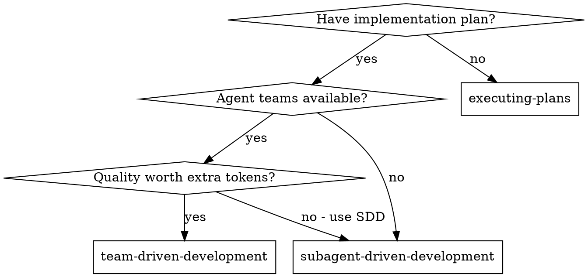
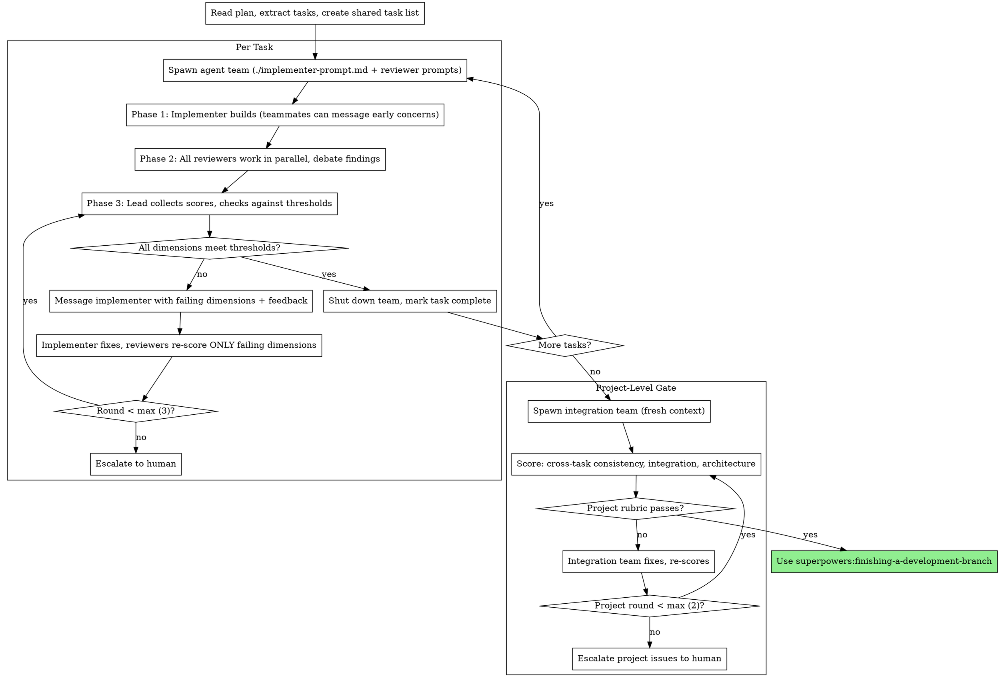

# Team-Driven Development

Execute plan by spawning agent teams with specialist teammates per task. Teammates review in parallel, debate findings adversarially, and score against a configurable rubric. Convergence loops repeat until all quality dimensions meet their thresholds.

**Why agent teams over subagents:** Agent teams are separate Claude Code instances that communicate directly with each other. Unlike subagents (which only report back to the caller), teammates can debate findings, challenge each other's assessments, and surface disagreements. This adversarial dynamic produces higher quality than sequential isolated review.

**Core principle:** Agent team per task + parallel specialist review + adversarial debate + scoring rubric convergence = highest quality output

**Prerequisite:** Requires `CLAUDE_CODE_EXPERIMENTAL_AGENT_TEAMS` enabled in settings.json or environment.

## When to Use



**vs. Subagent-Driven Development:**

| | SDD | Team-Driven |
|---|---|---|
| Primitive | Subagents (report back only) | Agent Teams (inter-agent communication) |
| Review | Sequential: spec → quality | Parallel: all specialists simultaneously |
| Quality gate | Pass/fail per reviewer | Numeric scoring rubric (1-10) with thresholds |
| Iteration | Fix loop per reviewer | Convergence loop until rubric met |
| Communication | Implementer ↔ controller only | Teammates debate and challenge each other |
| Dimensions | Fixed 2 review stages | 4 core + user-defined extras |
| Token cost | Lower | Higher (tradeoff for quality) |

## The Process



## Quality Rubric

The rubric is defined in the plan document header. It has 4 core dimensions (always present) plus user-configurable extras.

**Core Dimensions:**

| Dimension | Default Threshold | Teammate Role | Focus |
|-----------|-------------------|---------------|-------|
| Spec Compliance | ≥ 8 | Spec Reviewer | Does implementation match plan exactly? |
| Code Quality | ≥ 7 | Code Quality Reviewer | Clean, maintainable, follows patterns? |
| Test Coverage | ≥ 7 | Test Analyst | Tests meaningful, edge cases covered? |
| Correctness | ≥ 8 | Correctness Reviewer | Does it actually work? Integration sound? |

**Custom Dimensions (examples):**

| Dimension | Teammate Role | When to add |
|-----------|---------------|-------------|
| Security | Security Reviewer | Auth, user input, tokens, API keys |
| Performance | Performance Analyst | Hot paths, large data, latency-sensitive |
| Accessibility | Accessibility Reviewer | UI components, user-facing features |
| i18n | i18n Reviewer | Multi-language, locale-sensitive |

Each dimension spawns an additional teammate using `./custom-reviewer-prompt.md`.

**Scoring rules:**
- Each reviewer scores their dimension 1-10 with written justification
- All dimensions must meet their threshold for the task to pass
- On re-score rounds, only failing dimensions are re-evaluated
- Max 3 convergence rounds per task before escalating to human
- Max 2 rounds for project-level gate

## Rubric in Plan Header

When team-driven is chosen, the plan header includes:

```markdown
**Quality Rubric:**

| Dimension | Threshold | Teammate Role | Notes |
|-----------|-----------|---------------|-------|
| Spec Compliance | ≥ 8 | Spec Reviewer | Core |
| Code Quality | ≥ 7 | Code Quality Reviewer | Core |
| Test Coverage | ≥ 7 | Test Analyst | Core |
| Correctness | ≥ 8 | Correctness Reviewer | Core |

**Loop Config:**
- Max rounds per task: 3
- Max rounds project gate: 2
- Escalate to human on: threshold not met after max rounds
```

## Spawning the Team

For each task, the lead spawns an agent team:

```
Create an agent team for Task N: [task name].

Teammates:
- Implementer: [spawn with ./implementer-prompt.md content]
- Spec Reviewer: [spawn with ./spec-reviewer-prompt.md content]
- Code Quality Reviewer: [spawn with ./code-quality-reviewer-prompt.md content]
- Test Analyst: [spawn with ./test-analyst-prompt.md content]
- Correctness Reviewer: [spawn with ./correctness-reviewer-prompt.md content]
- [Custom reviewers from rubric config, each with ./custom-reviewer-prompt.md]

Require plan approval for Implementer before they make changes.
```

**Model Selection (same as SDD):**
- Mechanical implementation → fast, cheap model
- Integration/judgment → standard model
- Architecture/design/review → most capable model

## Handling Implementer Status

Same as SDD — implementers report DONE, DONE_WITH_CONCERNS, NEEDS_CONTEXT, or BLOCKED. Handle each per the SDD skill's guidance.

## Convergence Loop

The loop is event-driven, not interval-based:

**Round 1:**
1. Team spawned, implementer builds, reviewers review in parallel
2. Lead collects all scores
3. Any dimension below threshold? → Round 2

**Round 2+:**
1. Lead messages implementer with specific failing dimensions and reviewer feedback
2. Implementer fixes issues
3. Lead asks ONLY failing-dimension reviewers to re-score
4. Still below threshold? → Next round or escalate

**Escalation format:**
```
Task N stuck after 3 rounds.
Failing dimensions:
- Test Coverage: 6/7 — "Missing edge case for empty input, no error path tests"
- Spec Compliance: 7/8 — "Progress reporting interval hardcoded, spec says configurable"

Options:
1. Adjust thresholds (lower requirements)
2. Provide guidance (specific direction for implementer)
3. Skip this dimension (accept current score)
4. Take over manually
```

## Project-Level Gate

After all tasks complete:

1. Spawn fresh integration team (no per-task context pollution)
2. Teammates score across the entire implementation:
   - Cross-task consistency (naming, patterns, error handling)
   - Integration correctness (do components work together?)
   - Architectural coherence (does the whole make sense?)
3. Loop until passing or max 2 rounds → escalate

## Prompt Templates

- `./implementer-prompt.md` — Implementer teammate
- `./spec-reviewer-prompt.md` — Spec compliance reviewer (scores 1-10)
- `./code-quality-reviewer-prompt.md` — Code quality reviewer (scores 1-10)
- `./test-analyst-prompt.md` — Test coverage analyst (scores 1-10)
- `./correctness-reviewer-prompt.md` — Correctness/integration reviewer (scores 1-10)
- `./rubric-scorer-prompt.md` — Lead template for collecting and evaluating scores
- `./custom-reviewer-prompt.md` — Parameterized template for user-defined dimensions

## Red Flags

**Never:**
- Start implementation on main/master branch without explicit user consent
- Skip any rubric dimension (all must be scored)
- Proceed with dimensions below threshold without looping or escalating
- Let implementer self-review replace teammate review
- Spawn multiple implementation teammates in parallel for the same task (file conflicts)
- Skip the project-level gate after all tasks
- Shut down team before all scores are collected
- Re-score passing dimensions (waste of tokens)
- Exceed max convergence rounds without escalating to human

**If teammates disagree:**
- Disagreement is valuable — it surfaces real issues
- Lead should NOT suppress debate
- If reviewers challenge each other, let them resolve it
- Only intervene if debate becomes circular (3+ messages without progress)

**If implementer is blocked:**
- Same as SDD: provide context, upgrade model, break task, or escalate
- Never ignore escalation

## Integration

**Required workflow skills:**
- **superpowers:using-git-worktrees** — REQUIRED: Set up isolated workspace before starting
- **superpowers:writing-plans** — Creates the plan (modified to offer team-driven option)
- **superpowers:finishing-a-development-branch** — Complete development after all tasks

**Teammates should use:**
- **superpowers:test-driven-development** — Follow TDD for implementation

**Alternative workflows:**
- **superpowers:subagent-driven-development** — Lower cost, sequential review
- **superpowers:executing-plans** — Inline execution with checkpoints
